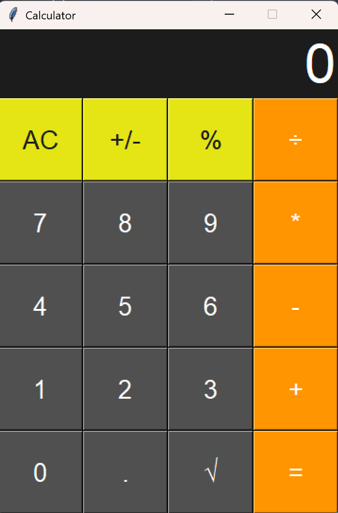

# Calculator

A simple GUI calculator built with Python and Tkinter.

## Features
- Basic arithmetic operations: addition, subtraction, multiplication, division
- Percentage calculation
- Square root calculation
- Toggle positive/negative
- Clear (AC) button
- Responsive and modern UI

## Screenshot


## Requirements
- Python 3.x
- Tkinter (usually included with Python)

## How to Run
1. Make sure you have Python installed.
2. Run the following command in your terminal:
   
   ```powershell
   python calculator.py
   ```

## Usage
- Click the buttons to enter numbers and operations.
- Use `AC` to clear the input.
- Use `+/-` to toggle the sign.
- Use `%` for percentage calculation.
- Use `√` for square root.
- Press `=` to get the result.

## File Structure
- `calculator.py`: Main application code
- `calc.png`: Calculator screenshot
- `README.md`: Project documentation

## License
This project is open source and free to use.
